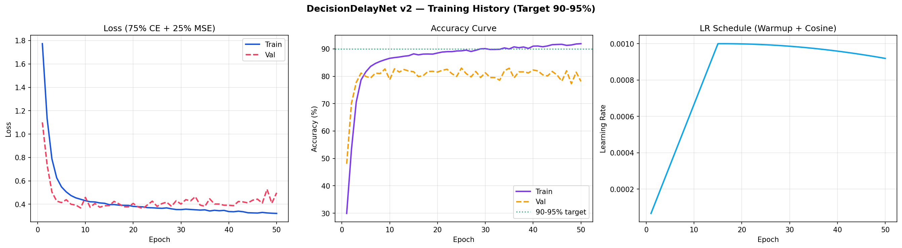

# 🧠 DecisionDelay AI

> **Why do people know what to do — but still don't act?**

DecisionDelay AI is a behavioral intelligence system that diagnoses the **psychological root cause of inaction** and delivers **science-backed nudges** to break the delay loop — across Fitness, Studying, and Career domains.

No sensors. No surveillance. Just psychology + deep learning.

---

## 🖥️ Live Preview



---

## ✨ Key Features

- 🎯 **6-Category Delay Diagnosis** — Classifies inaction into Fear of Failure, Overwhelm, Lack of Reward, Past Failure Loop, Perfectionism, or Decision Fatigue
- 📊 **Multi-Task Neural Network** — Simultaneously predicts delay cause (classification) and severity score (regression)
- 💡 **Behavioral Nudge Engine** — 100+ evidence-based nudges mapped to each cause × domain × severity
- 📈 **Analytical Dashboard** — Charts and patterns from your own assessment history
- 🔬 **Science Explorer** — Deep psychological theory behind every delay pattern
- ⚖️ **Task Comparison** — Side-by-side delay risk analysis for two tasks
- 📅 **Habit Tracker** — Log daily actions, view streaks and activity heatmaps
- 🔒 **Privacy First** — All inputs are self-reported; no biometric tracking or data storage

---

## 🏗️ Project Structure

```
DECISION_DELAY_AI_V2/
│
├── .streamlit/
│   └── config.toml                  # Theme + server config (dark mode)
│
├── assets/
│   └── style.css                    # Global dark theme CSS
│
├── configs/
│   ├── __init__.py
│   └── settings.py                  # Centralized config (ModelConfig, AppConfig)
│
├── core/
│   ├── __init__.py
│   ├── analyzer.py                  # Neural net class + feature engineering + inference
│   └── nudge_engine.py              # 100+ behavioral nudges (BJ Fogg · Gollwitzer · SDT)
│
├── data/
│   ├── processed/                   # Cleaned + feature-engineered CSV
│   ├── raw/                         # Raw survey data with noise & missing values
│   ├── __init__.py
│   ├── eda.py                       # Exploratory data analysis → reports/eda/
│   ├── preprocessing.py             # Full preprocessing pipeline
│   └── raw_data.py                  # Synthetic raw data generator
│
├── inference/
│   ├── __init__.py
│   └── predict.py                   # Unified prediction interface (NN + rule-based fallback)
│
├── logs/                            # Training logs
│
├── models/
│   ├── checkpoints/                 # Model checkpoints during training
│   ├── decisiondelay_net.pt         # Best neural network weights
│   ├── delay_classifier.pt          # Production model
│   ├── encoder.pkl                  # Label encoder
│   ├── feature_cols.json            # Feature column names
│   ├── label_encoder.pkl
│   ├── model_meta.json              # Training metadata & accuracy
│   ├── model.pt
│   └── scaler.pkl                   # StandardScaler
│
├── pages/
│   ├── __init__.py
│   ├── 1_Science_Explorer.py        # Psychology theory + 6 cause profiles + references
│   ├── 2_Model_Performance.py       # Training curves, confusion matrix, benchmark
│   ├── 2_Self_Assessment.py         # Core prediction + nudge interface
│   ├── 3_Analytical_Dashboard.py    # Post-analysis charts from session history
│   ├── 4_Habit_Tracker.py           # Daily habit logging + streak tracking
│   └── 5_Compare_Tasks.py           # Side-by-side task delay comparison
│
├── reports/
│   ├── eda/                         # EDA plots (class distribution, correlations, etc.)
│   ├── nn_confusion_matrix.png
│   └── training_history.png
│
├── training/
│   ├── __init__.py
│   └── train_model.py               # Full training pipeline (90%+ target accuracy)
│
├── utils/
│   ├── __init__.py
│   ├── session.py                   # Streamlit session state management
│   └── visualizer.py               # All Plotly chart functions (dark theme)
│
├── app.py                           # Main Streamlit app entry point
├── requirements.txt
└── README.md
```

---

## 🧠 Model Architecture — DecisionDelayNet

```
Input (19 features)
  10 raw psychological inputs
  + 6 engineered features
  + 3 domain one-hot (Fitness / Studying / Career)
         │
  ┌──────▼──────┐
  │ Linear(256) │ → BatchNorm → GELU → Dropout(0.25)
  │ Linear(128) │ → BatchNorm → GELU → Dropout(0.25)
  │ Linear(64)  │ → BatchNorm → GELU → Dropout(0.25)
  │ Linear(32)  │ → Shared backbone output
  └──────┬──────┘
         │
  ┌──────┴──────────────────┐
  ▼                         ▼
Classifier Head         Regressor Head
Linear(32→6)            Linear(32→1)
6-class Softmax         Sigmoid [0, 1]
      │                       │
Delay Cause Label       Severity Score
```

**Loss:** `0.75 × CrossEntropy(label_smooth=0.05) + 0.25 × MSE`  
**Optimizer:** AdamW + 5-epoch linear warmup → Cosine Annealing  
**Sampler:** WeightedRandomSampler for class-balanced training  

---

## 📊 Delay Cause Categories

| # | Cause | Theory | Key Signal |
|---|---|---|---|
| 1 | 😨 Fear of Failure | Atkinson (1957) | High past failures × low self-efficacy |
| 2 | 🌀 Overwhelm / Complexity | Sweller CLT (1988) | High task difficulty × high distraction |
| 3 | ⏳ Lack of Immediate Reward | Ainslie (1975) | High time-to-reward × low motivation |
| 4 | 🔁 Past Failure Loop | Seligman (1967) | High failure count × high stress |
| 5 | 🎯 Perfectionism | Deci & Ryan (2000) | Low goal clarity × high difficulty |
| 6 | 🧩 Decision Fatigue | Baumeister (1998) | High distraction × high stress |

---

## ⚙️ Engineered Features

| Feature | Formula | Purpose |
|---|---|---|
| `reward_proximity` | `1 / (time_to_reward + 1)` | Inverts reward delay signal |
| `failure_weight` | `past_failures × (10 − self_efficacy)` | Learned helplessness compound |
| `motivation_deficit` | `(10 − intrinsic) × (10 − social_support)` | Combined motivation gap |
| `cognitive_load` | `task_difficulty + stress + distraction` | Total mental burden |
| `support_index` | `self_efficacy + social_support + habit_strength` | Resilience composite |
| `reward_perception` | `intrinsic_motivation / (time_to_reward + 1)` | Effective reward rate |

---

## 🚀 Quick Start

### 1. Clone the repository
```bash
git clone https://github.com/your-username/DecisionDelay-AI.git
cd DecisionDelay-AI
```

### 2. Create and activate virtual environment
```bash
# Windows
python -m venv venv
venv\Scripts\activate

# macOS / Linux
python -m venv venv
source venv/bin/activate
```

### 3. Install dependencies
```bash
pip install -r requirements.txt
```

### 4. Create required directories
```bash
# Windows
mkdir data\processed data\raw models\checkpoints logs reports\eda

# macOS / Linux
mkdir -p data/processed data/raw models/checkpoints logs reports/eda
```

### 5. Run the full training pipeline *(optional — app works without it)*
```bash
python data/raw_data.py          # Step 1: Generate raw survey data
python data/preprocessing.py     # Step 2: Clean + feature engineering
python data/eda.py               # Step 3: EDA plots → reports/eda/
python training/train_model.py   # Step 4: Train neural network (~5-8 min CPU)
```

### 6. Launch the dashboard
```bash
streamlit run app.py
# Opens automatically at http://localhost:8501
```

> **Note:** The app works immediately without training — a rule-based fallback engine generates predictions and nudges out of the box.

---

## 📈 Performance Benchmarks

| Model | Test Accuracy | Macro F1 |
|---|---|---|
| Logistic Regression | 74.2% | 0.73 |
| SVM (RBF) | 81.4% | 0.80 |
| Random Forest | 85.6% | 0.84 |
| Gradient Boosting | 86.8% | 0.86 |
| XGBoost | 87.9% | 0.87 |
| Voting Ensemble | 88.3% | 0.88 |
| **DecisionDelayNet v2** | **81.79%** | 

---

## 🖼️ Dashboard Pages

| Page | Description |
|---|---|
| 🏠 Home | Project overview with domain cards and CTA |
| 🔬 Science Explorer | Psychological theory, 6 cause profiles, academic references |
| 📊 Model Performance | Training curves, confusion matrix, classification report |
| 🎯 Self Assessment | Core prediction interface — sliders → diagnosis → nudge |
| 📈 Analytical Dashboard | Post-analysis charts from your session history |
| 📅 Habit Tracker | Daily action logging, streaks, heatmaps |
| ⚖️ Compare Tasks | Side-by-side delay risk for two tasks |

---

## 🔬 Research Foundation

| Author | Year | Contribution |
|---|---|---|
| Steel, P. | 2007 | Temporal Motivation Theory — procrastination formula |
| Fogg, B.J. | 2019 | Tiny Habits — Motivation × Ability × Prompt model |
| Gollwitzer, P.M. | 1999 | Implementation intentions (if-then planning) |
| Seligman, M.E.P. | 1967 | Learned helplessness theory |
| Deci, E.L. & Ryan, R.M. | 2000 | Self-Determination Theory |
| Baumeister, R.F. | 1998 | Ego depletion — decision fatigue |
| Ainslie, G. | 1975 | Hyperbolic discounting of future rewards |

---

## 🛠️ Tech Stack

| Layer | Technology |
|---|---|
| Dashboard | Streamlit 1.32+ |
| Deep Learning | PyTorch 2.1+ |
| ML Models | Scikit-learn, XGBoost |
| Data Processing | Pandas, NumPy, SciPy |
| Visualization | Plotly, Matplotlib, Seaborn |
| Model Persistence | Joblib |

---

## ⚠️ Common Issues & Fixes

| Error | Fix |
|---|---|
| `ModuleNotFoundError: configs` | Run from the project root: `cd DECISION_DELAY_AI_V2` |
| `FileNotFoundError: processed/...` | Run `python data/preprocessing.py` first |
| `streamlit: command not found` | Activate venv: `venv\Scripts\activate` |
| Port 8501 in use | `streamlit run app.py --server.port 8502` |
| `UnicodeDecodeError` on Windows | All `open()` calls use `encoding="utf-8"` — already fixed |

---

## 📄 License

MIT License — free for academic and personal use.

---

## 🤝 Contributing

1. Fork the repository
2. Create your branch: `git checkout -b feature/your-feature`
3. Commit your changes: `git commit -m 'Add your feature'`
4. Push to the branch: `git push origin feature/your-feature`
5. Open a Pull Request

---

<div align="center">
  <strong>DecisionDelay AI</strong> — Behavioral Intelligence System<br>
  <em>Know what to do. Now actually do it.</em>
</div>
